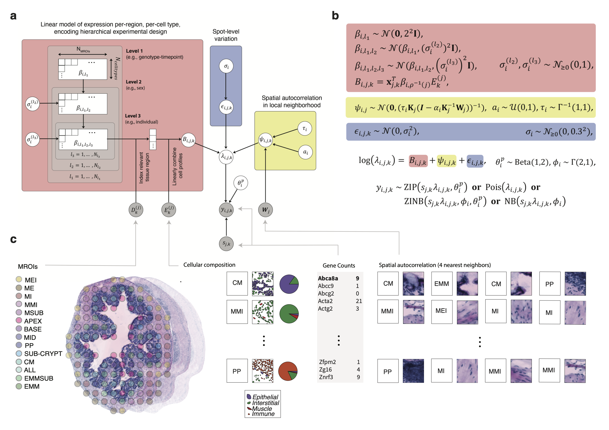

# cSplotch

cSplotch is a hierarchical generative probabilistic model for analyzing Spatial Transcriptomics (ST) [[1]](#references) data.


Features
-------------
- Supports complex hierarchical experimental designs and model-based analysis of replicates
- Full Bayesian inference with Hamiltonian Monte Carlo (HMC) using the adaptive HMC sampler as implemented in Stan [[2]](#references)
- Analysis of expression differences between anatomical regions and conditions using posterior samples
- Different anatomical annotated regions are modelled using a linear model
- Zero-inflated Poisson or Poisson likelihood for counts
- Conditional autoregressive (CAR) prior for spatial random effect
- Ability to deconvolve gene expression into cell type-specific signatures using compositional data gathered from histology images
- Use single-cell/single-nuclear expression data to calculate priors over expression in each cell type

We support the original ST array design (1007 spots, a diameter of 100 μm, and a center-to-center distance of 200 μm) by [Spatial Transcriptomics AB](https://spatialtranscriptomics.com), as well as [Visium Spatial Gene Expression Solution](https://www.10xgenomics.com/spatial-transcriptomics/) by [10x Genomics, Inc.](https://www.10xgenomics.com), interfacing directly with file formats output by [Spaceranger and Loupe Browser](https://support.10xgenomics.com/spatial-gene-expression/software/pipelines/latest/output/overview).

The cSplotch code in this repository supports single-, two-, and three-level experimental designs. These three different hierarchical models are illustrated below: 



## Installation

Tested on Python 3.10

cSplotch has been tested on Mac and Linux. It has not been tested on Windows.

#### Installing cSplotch

The following command installs the cSplotch Python module:

```console
$ pip install git+https://git@github.com/adaly/cSplotch.git
```

As a result of this, the user will have the executables ``splotch``, ``splotch_prepare_count_files``, ``splotch_generate_input_files``, ``splotch_compile_lamdbas`` and ``splotch_compile_betas``

For ``splotch_prepare_count_files`` and ``splotch_generate_input_files``, the inputs are assumed to be in Visium v1/v2 format unless the ``-B/--hd-binning`` (Visium HD) or ``-S/--st-v1`` (ST v1) flags are passed. We will discuss the differences in input format in the subsequent sections.

#### Installing CmdStan
[CmdStan](https://mc-stan.org/users/interfaces/cmdstan) [[2]](#references) can be installed as follows
```console
$ STAN_VERSION=`curl -s https://api.github.com/repos/stan-dev/cmdstan/releases/latest | sed -n 's/.*"tag_name": "v\([^"]*\)",$/\1/p'`
$ cd $HOME
$ curl -LO https://github.com/stan-dev/cmdstan/releases/download/v"$STAN_VERSION"/cmdstan-"$STAN_VERSION".tar.gz
$ tar -xzvf cmdstan-"$STAN_VERSION".tar.gz
$ cd cmdstan-"$STAN_VERSION"
$ make build -j4
```
This will install CmdStan in the directory  ``$HOME/cmdstan-$STAN_VERSION``.

The latest CmdStan user guide can be found at https://github.com/stan-dev/cmdstan/releases.

#### Compiling cSplotch
The cSplotch Stan models ``splotch_stan_model.stan`` and ``comp_splotch_stan_model.stan`` can be compiled using [CmdStan](#installing-cmdstan) as follows
```console
$ cd $HOME
$ cd cmdstan-"$STAN_VERSION"
$ make $HOME/cSplotch/stan/splotch_stan_model
$ make $HOME/cSplotch/stan/comp_splotch_stan_model

--- Translating Stan model to C++ code ---
⋮
```
Here we assume you have [installed CmdStan](installing-cmdstan) in the directory ``$HOME/cmdstan-$STAN_VERSION`` and have the cSplotch code in the directory ``$HOME/cSplotch``. Please change the paths if your environment differs.

After a successful compilation, you will have the binaries ``splotch_stan_model`` and ``comp_splotch_stan_model`` in the directory ``$HOME/cSplotch/stan``
```console
$ $HOME/cSplotch/stan/splotch_stan_model
$ $HOME/cSplotch/stan/comp_splotch_stan_model
Usage: [comp_]splotch_stan_model <arg1> <subarg1_1> ... <subarg1_m> ... <arg_n> <subarg_n_1> ... <subarg_n_m>
⋮
Failed to parse arguments, terminating Stan
````

## Usage
The main steps of cSplotch analysis are the following:

1. [Preparation of count files](#preparation-of-count-files)
    - ``splotch_prepare_count_files``
2. [Annotation of ST spots](#annotation-of-st-spots)
    - [Visium/VisiumHD](#visium-st-count-data)
    - [ST v1](#original-st-count-data)
3. [Annotation of cell types](#annotation-of-cell-types)
4. [Preparation of metadata table](#preparation-of-metadata-table)
    - [Visium ST](#visium-st-annotations)
    - [Original ST](#original-st-annotations)
5. [Preparation of input data files for cSplotch](#preparation-of-input-data-for-splotch)
    - ``splotch_generate_input_files``
6. [cSplotch analysis](#splotch-analysis)
    - ``splotch``
7. [Summarizing cSplotch output](#summarizing-csplotch-output)
    - ``splotch_compile_lambdas``
    - ``splotch_compile_betas``
8. [Downstream analysis](#downstream-analysis)

Below we will describe these steps in detail.

#### Example data

In the directory ``examples``, we have some example ST data [[3]](#references). We will use this example data set in this documentation to demonstrate the use of cSplotch.

### Preparation of count files

The inputs to the count file preparation script differ depending on whether the user is supplying data from Visium/Visium HD or ST v1. Both cases are outlined below.

#### Visium/Visium HD count data

When working with data from the Visium platform, count data are expected in the form of the output of [spaceranger count](https://support.10xgenomics.com/spatial-gene-expression/software/pipelines/latest/using/count), which produces a structured directory containing count and metadata information for each sample.

Prior to downstream analysis, we must ensure that each array contains the same genes in the same index order. This is achieved through the use of the ``splotch_prepare_count_files`` (the ``-V/--Visium`` flag is set by default) on **all arrays to be included in analysis**. The output of the script will be an additional Splotch-formatted count file (default: [ARRAY_NAME.unified.tsv.gz]) created within the top level of each spaceranger output directory.

```console
$ splotch_prepare_count_files --help

usage: splotch_prepare_count_files [-h] -c COUNT_DATA [SPACERANGER_COUNT_DIRS ...]
                                   [-s SUFFIX] [-d MINIMUM_DETECTION_RATE]
                                   [-V] [-B NAME_OF_BINNING] [-S]

A script for preparing count files for cSplotch

optional arguments:
-h, --help              show this help message and exit
-c COUNT_DATA [SPACERANGER_COUNT_DIRS ...], --count_data [SPACERANGER_COUNT_DIRS ...]
                        list of spaceranger count directories
-s SUFFIX, --suffix SUFFIX
                        suffix to be added to the sample name in creation of cSplotch count file within each spaceranger directory
                        (default is .unified.tsv.gz for Visium/STv1, .unified.hdf5 for Visium HD)
-d MINIMUM_DETECTION_RATE, --minimum_detection_rate MINIMUM_DETECTION_RATE
                        minimum detection rate (default is 0.02)
-V, --Visium            data are from the Visium platform (default)
-B NAME_OF_BINNING, --hd-binning NAME_OF_BINNING
                        name of binning to use (Visium HD only); must be a directory within */outs/binned_outputs for all SPACERANGER_COUNT_DIRS
-S, --st-v1             data are from the STv1 platform (overrides -V and -B)  
```

#### ST v1 count data

Count data from original ST workflow are fully represented by a single tab-separated value (TSV) file of the following format:

|               | 32.06_2.04 | 31.16_2.04 | 14.07_2.1 |  …         | 28.16_33.01 |
|---------------|------------|------------|-----------|------------|-------------|
| A130010J15Rik | 0          | 0          | 0         |  …         |  0          |
| A230046K03Rik | 0          | 0          | 0         |  …         |  0          |
| A230050P20Rik | 0          | 0          | 0         |  …         |  0          |
| A2m           | 0          | 1          | 0         |  …         |  0          |
| ⋮             | ⋮          | ⋮          | ⋮         |  ⋱         |  ⋮         |
| Zzz3          | 0          | 1          | 0         |  …         |  0        |

The rows and columns have gene identifiers and ST spot coordinates (in ``XCOORD_YCOORD`` format), respectively.

``splotch_prepare_count_files`` is applied identically to above, but with the ``-c/--count_data`` argument pointing to a list of count files in the above format, and with the ``-S/--st-v1`` flag set.

#### Example

For instance, the following command prepares the count files located in ``examples/Count_Tables`` [[3]](#references)
```console
$ splotch_prepare_count_files -c examples/Count_Tables/*_stdata_aligned_counts_IDs.txt -S
INFO:root:Reading 10 count files
INFO:root:We have detected 18509 genes
INFO:root:We keep 11313 genes after discarding the lowly expressed genes (detected in less than 2.00% of the ST spots)
INFO:root:The median sequencing depth across the ST spots is 2389
```

### Annotation of ST spots
To get the most out of the statistical model of cSplotch one has to annotate the ST spots based on their tissue context. These annotations will allow the model to share information across tissue sections, resulting in more robust conclusions.

#### Visium ST annotations

10x Genomics have provided a tool for the exploration and annotation of Visium/Visium HD data called [Loupe](https://support.10xgenomics.com/spatial-gene-expression/software/visualization/latest/what-is-loupe-browser). 

When working with Visium data, we expect annnotation files in the CSV format exported by the Loupe browser

| Barcode            | Label          |
|--------------------|----------------|
| AAACACCAATAACTGC-1 | Vent_Med_White |
| AAACATGGTGAGAGGA-1 | Vent_Horn      |
| AAACATTTCCCGGATT-1 | Lat_Edge       |
| AAACCTAAGCAGCCGG-1 | Vent_Horn      |
| AAACGAAGATGGAGTA-1 | Vent_Horn      |
| AAACGAGACGGTTGAT-1 | Med_Lat_White  |
| AAACGGGCGTACGGGT-1 | Vent_Horn      |

The Barcode column specifies the spatial barcode associated with each spot/bin in the Visium array (mapped to array/pixel coordinates through the file ``outs/spatial/tissue_positions.csv`` (Visium v1/v2) or ``outs/binned_outputs/[NAME_OF_BINNING]/spatial/tissue_positions.parquet (Visium HD)) while the second column contains a single label for each spot.

ST spots without annotation categories are discarded by ``splotch_generate_input_files`` (please see [Preparation of the input data files for Splotch](#preparation-of-the-input-data-files-for-splotch)). This behaviour can be useful when you want to discard some ST spots from the analysis based on the tissue histology.

Annotation files for the count files in ``examples/Counts_Tables`` are located in ``examples/Annotations`` [3].

#### ST v1 annotations

To make the annotation step slightly less tedious in the original ST workflow, we have implemented a light-weight js tool called [Span](https://github.com/tare/Span).

The annotation files have the following TSV file format

|                | 32.06_2.04 | 31.16_2.04 | 14.07_2.1 | … | 28.16_33.01 | 
|----------------|------------|------------|-----------|---|-------------| 
| Vent_Med_White | 0          | 0          | 0         | … | 0           | 
| Vent_Horn      | 1          | 1          | 0         | … | 0           | 
| Vent_Lat_White | 0          | 0          | 0         | … | 0           | 
| Med_Grey       | 0          | 0          | 0         | … | 0           | 
| Dors_Horn      | 0          | 0          | 0         | … | 0           | 
| Dors_Edge      | 0          | 0          | 0         | … | 1           | 
| Med_Lat_White  | 0          | 0          | 0         | … | 0           | 
| Vent_Edge      | 0          | 0          | 1         | … | 0           | 
| Dors_Med_White | 0          | 0          | 0         | … | 0           | 
| Cent_Can       | 0          | 0          | 0         | … | 0           | 
| Lat_Edge       | 0          | 0          | 0         | … | 0           | 

The rows and columns correspond to the user-define anatomical annotation regions (AAR) and ST spot coordinates, respectively. For instance, the spot 32.06_2.04 has the Vent_Horn annotation (i.e. located in ventral horn). The annotation category of each ST spot is **one-hot encoded** and we do not currently support more than one annotation category per ST spot.


### Annotation of cell types

In order to deconvolve the characteristic expression estimates (beta) into cell-type associated signatures, the user must provide additional annotation information on the cellular composition of each spot. For a defined number of cell types $K$, this takes the form of a $K$-simplex describing the proportion of the spot (by area) covered by each cell type. In order to obtain these annotations, one may train a semantic segmentation model such as [Ilastik](https://www.ilastik.org/) to label cells based on morphological features extracted from their nuclei (see publication for details on our approach). 

Cellular composition data for each ST array should take the form of a ($K$ rows x $N_{spots}$ columns) table, where all columns sum to 1:

|           | 32.06_2.04 | 31.16_2.04 | 14.07_2.1 | ... | 28.16_33.01 |
|-----------|------------|------------|-----------|-----|-------------|
| CellType1 | 0.0        | 0.15       | 0.0       | ... | 0.25        |
| CellType2 | 0.45       | 0.55       | 0.2       | ... | 0.25        |
| CellType3 | 0.55       | 0.3        | 0.8       | ... | 0.5         |


### Preparation of metadata table
The metadata table contains information about the samples (i.e. count files). Additionally, the metadata table is used for matching count and annotation files.

The metadata table has the following TSV file format

| Name      | Level 1   | Level 2 | Level 3 | Spaceranger output    | Count file                                        | Annotation file                    | Image file                       | 
|-----------|-----------|---------|---------|-----------------------|---------------------------------------------------|------------------------------------|----------------------------------| 
| L7CN36_C1 | G93A p120 | F       | 1394    | Spaceranger/L7CN36_C1 | Spaceranger/L7CN36_C1/L7CN36_C1.unified.tsv.gz    | Annotations/L7CN36_C1.tsv          | Images/L7CN36_C1_HE.jpg          | 
| L7CN30_C1 | G93A p120 | F       | 2967    | Spaceranger/L7CN30_C1 | Spaceranger/L7CN30_C1/L7CN30_C1.unified.tsv.gz    | Annotations/L7CN30_C1.tsv          | Images/L7CN30_C1_HE.jpg          | 
| L7CN69_D1 | WT p120   | M       | 1310    | Spaceranger/L7CN69_D1 | Spaceranger/L7CN69_D1/L7CN69_D1.unified.tsv.gz    | Annotations/L7CN69_D1.tsv          | Images/L7CN69_D1_HE.jpg          | 
| L7CN69_D2 | WT p120   | M       | 1310    | Spaceranger/L7CN69_D2 | Spaceranger/L7CN69_D2/L7CN69_D2.unified.tsv.gz    | Annotations/L7CN69_D2.tsv          | Images/L7CN69_D2_HE.jpg          | 

Each sample (i.e. count file) has its own row in the metadata table. The columns ``Level 1``, ``Spaceranger output`` (Visium/Visium HD only), ``Count file`` (generated by ``splotch_prepare_count_files``), and  ``Annotation file`` are mandatory.  The column ``Level 2`` is mandatory when using the two-level model. Whereas, the columns ``Level 2`` and ``Level 3`` are mandatory when using the three-level model. The columns ``Level 1``, ``Level 2``, and ``Level 3`` define how the samples are analyzed using the linear multilevel model.

#### ST v1 metadata
ST v1 data do not require the ``Spaceranger output`` column, only ``Count file``.

#### Compositional metatada
Deconvolutional analysis requires an **additional column, "Composition file"**, that points to the [cell type composition file](#annotation-of-cell-types) associated with each sample.

The user can include additional columns at their own discretion. For instance, we will use the column ``Image file`` in [Tutorial.ipynb](Tutorial.ipynb).

The metadata table containing information about the provided example data set can be found at ``examples/metadata.tsv``.

### Preparation of input data for cSplotch
Stan can only read data in R dump format, in which variables are declared as scalars, sequences, or general arrays and defined in terms of their dimensionalities and values. Therefore, we have to make the ST data compatible with the data types in Stan (e.g. Stan does not have ragged array or dictionary data types).

To make this step less painful for the user, we have provided the script ``splotch_generate_input_files``
```console
$ splotch_generate_input_files --help
usage: splotch_generate_input_files [-h] [-v] -c COUNT_FILES [COUNT_FILES ...] -m
                                    METADATA_FILE -s SCALING_FACTOR
                                    [-l N_LEVELS]
                                    [-d MINIMUM_SEQUENCING_DEPTH]
                                    [-t MAXIMUM_NUMBER_OF_SPOTS_PER_TISSUE_SECTION]
                                    [-n] [-z] [-o OUTPUT_DIRECTORY] 
                                    [-V] [-B NAME_OF_BINNING] [-S]
                                    [-p] [-e SINGLE_CELL_ANNDATA] [-g GROUP_KEY] [-G GENE_SYMBOLS]

A script for generating input data for cSplotch
  
optional arguments:
-h, --help            show this help message and exit
-c COUNT_FILES [COUNT_FILES ...], --count_files COUNT_FILES [COUNT_FILES ...]
                      list of read count filenames (output from splotch_prepare_count_files)
-m METADATA_FILE, --metadata_file METADATA_FILE
                      metadata filename
-s SCALING_FACTOR, --scaling_factor SCALING_FACTOR
                      scaling_factor (e.g. median sequencing depth over spots)
-l N_LEVELS, --n_levels N_LEVELS
                      number of levels in the linear model (default is 3)
-d MINIMUM_SEQUENCING_DEPTH, --min_depth MINIMUM_SEQUENCING_DEPTH
                      minimum number of UMIs per spot (default is 100)
-t MAXIMUM_NUMBER_OF_SPOTS_PER_TISSUE_SECTION, --t MAXIMUM_NUMBER_OF_SPOTS_PER_TISSUE_SECTION
                      number of spots threshold for identifying overlapping
                      tissue sections (default is 4992 for Visium, 200k for VisiumHD, 2000 for ST v1)
-n, --no-car          disable the conditional autoregressive prior
-z, --no-zip          use the Poisson likelihood instead of the zero-
                      inflated Poisson likelihood
-o OUTPUT_DIRECTORY, --output_directory OUTPUT_DIRECTORY
                      output_directory (default is data)
-V, --Visium          data are from the Visium platform (default)
-B NAME_OF_BINNING, --hd-binning NAME_OF_BINNING
                      name of binning to use (Visium HD only); must be a directory within */outs/binned_outputs for all SPACERANGER_COUNT_DIRS
-S, --st-v1           data are from the ST v1 platform
-v, --version         show program's version number and exit
-p, --compositional   deconvolve expression into cell-type specific signatures using 
                      compositional annotations
-e, --empirical_priors  
                      use single-cell AnnData object (HDF5 format) to inform priors
                      over gene expression in each cell type (--compositional only)
-g, --sc-group-key    key in single-cell AnnData.obs containing cell type annotations 
                      (--compositional only; must match cell type naming in annotation files)
-G, --sc-gene-symbols key in single-cell AnnData.var corresponding to gene names in ST count data
                      (--compositional only; must match gene names in count files)
```

The input files are saved in subdirectories (i.e. 100 files per subdirectory to limit the number of files per directory) in the directory specified using ``-o OUTPUT_DIRECTORY``. There will be as many input files as there were genes in the prepared count files (please see [Preparation of count files](#preparation-of-count-files)). Moreover, the input file indices match with the line numbers of the prepared count files (header line is not taken into account); i.e. the data of the gene on the 4<sup>th</sup> row is saved in the file ``OUTPUT_DIRECTORY/0/data_3.R``.

Note that ``splotch_generate_input_files`` process the intersection of the count files provided using ``-c COUNT_FILES`` and the count files listed in the metadata table provided using ``-m METADATA_FILE``. Therefore, the metadata table might cover additional samples.

Additionally, the file ``OUTPUT_DIRECTORY/information.p`` is created to help the interpretation of the results. The use of  the file ``information.p`` is demonstrated in [Tutorial.ipynb](Tutorial.ipynb).

Note that the input data have to be generated differently for the single-, two-, and three-level models. To generate the data files for the single-, and two-, or three-level models please provide ``-l 1``, ``-l 2``, or ``-l 3``, respectively. Moreover, with ``-l 1`` we only consider the ``Level 1`` column in metadata table, whereas with ``-l 2`` we will consider the ``Level 1`` and ``Level 2`` columns. As expected, with ``-l 3`` we will consider the ``Level 1``, ``Level 2``, and ``Level 3`` columns.

The zero-inflated Poisson likelihood is the default but the Poisson likelihood can be enabled by providing ``-z``.

The CAR prior can be disabled by providing ``-n``.

#### Example

As an example, we have provided ``Level 1``, ``Level 2``, and ``Level 3`` metadata on the samples in ``examples/metadata.tsv`` and we wish to analyze the data using the three-level model with the CAR prior and zero-inflated Poisson likelihood . In this case, we can prepare the input data files for cSplotch as follows
```console
$ splotch_generate_input_files -c examples/Count_Tables/*_stdata_aligned_counts_IDs.txt.unified.tsv -m examples/metadata.tsv -s 2389.0 -l 3 -o data_three
INFO:root:Reading metadata
INFO:root:Initializing
INFO:root:beta_level_1[1] := G93A p120
INFO:root:beta_level_2[1] := G93A p120 F
INFO:root:beta_level_3[1] := G93A p120 F 1394
INFO:root:beta_level_2[2] := G93A p120 M
INFO:root:beta_level_3[2] := G93A p120 M 975
INFO:root:beta_level_1[2] := WT p120
INFO:root:beta_level_2[3] := WT p120 M
INFO:root:beta_level_3[3] := WT p120 M 2967
INFO:root:beta_level_3[4] := WT p120 M 1310
INFO:root:beta_level_2[4] := WT p120 F
INFO:root:beta_level_3[5] := WT p120 F 1040
⋮
INFO:root:Saving additional information (data_three/information.p)
INFO:root:Finished
```

The input data files are saved in the directory ``data_three``.


### cSplotch analysis
Please make sure you have [compiled the cSplotch models](#installation) before continuing with this section.

The provided Bash script ``splotch`` is a wrapper for running cSplotch
```console
$ splotch -h
usage: splotch [-h] -g GENE_IDX -d DATA_DIRECTORY -o OUTPUT_DIRECTORY
               -b BINARY -n NUM_SAMPLES -c NUM_CHAINS [-s]

A wrapper for running cSplotch

optional arguments:
-h     show this help message and exit
-g     gene index
-d     data directory
-o     output directory
-b     cSplotch binary
-n     number of samples
-c     number of chains
-s     store summary statistics instead of full posteriors for all variables besides betas (much more memory-efficient!)
```
The wrapper will start separate processes for independent MCMC chains, and it will concatenate the samples from the HMC chains.

Note that ``splotch`` forks a process for each requested chain (``-c NUM_CHAINS``).

Moreover,  ``splotch`` follows the same subdirectory scheme (in ``-c OUTPUT_DIRECTORY``) as ``splotch_generate_input_files``.

The use of parallel computing to speed up the computation is trivial because cSplotch is embarrassingly parallel across genes.

#### Example

As an example, let us assume that we want to analyze *Gfap*; to find the corresponding index we can run the following cryptic command
```command
GENE="Gfap"; echo $(($(grep -wn "$GENE" $(cut -f$(head -n1 examples/metadata.tsv | tr "\t" "\n" | grep -n "Count file"| cut -d: -f1) examples/metadata.tsv | sed -n '2p')|cut -f1 | cut -d: -f1)-1))
3661
```
The command is a bit complicated because we first have to find the index of the column ``Count file`` in ``examples/metadata.tsv`` to find a relevant count file. Whereas, if you are willing to supply the name of a count file, then the following command is sufficient
```console
$ GENE="Gfap"; COUNT_FILE="examples/Count_Tables/CN93_E1_stdata_aligned_counts_IDs.txt.unified.tsv"; echo $(($(grep -wn "$GENE" "$COUNT_FILE" |cut -d: -f1)-1))
3661
```
The 3661<sup>st</sup> (not taking into account the header line) line of the prepared count files (please see [Preparation of count files](#preparation-of-count-files))  corresponds to *Gfap*.

In the previous section, we ran ``splotch_generate_input_files`` with the arguments ``-l 3 -o data_three``. Thus, we can analyze the example ST data on *Gfap* as follows
```console
$ splotch -g 3661 -n 200 -c 4 -b splotch_stan_model -d data_three -o output_three
method = sample (Default)
sample
num_samples = 200
num_warmup = 200
save_warmup = 0 (Default)
thin = 1 (Default)
adapt
⋮
Elapsed Time: 89.3442 seconds (Warm-up)
              26.6335 seconds (Sampling)
              115.978 seconds (Total)
```

The output is saved in the file ``output_three/36/combined_3661.csv``. 

### Summarizing cSplotch output 
Because the output from cSplotch can be quite large, depending on the number of genes and spots in the dataset, we provide two command-line tools for summarizing the output in HDF5-formatted AnnData files:

```console
$ splotch_compile_lambdas -h
usage: splotch_compile_lambdas [-h] -m META_FILE -i INPUT_DIR -o OUTPUT_DIR -d DEST_FILE
               
Summarizes all spot-level variables, including raw counts, predicted cellular composition, and inferred expression rates (lambda).

arguments:
-h     show this help message and exit
-m     path to cSplotch metadata file
-i     top-level directory containing csplotch input files
-o     top-level directory containing SUMMARIZED (combined_*.hdf5, generated with -s option to splotch) csplotch output files
-d     destination file (.hdf5)
```

```console
$ splotch_compile_betas -h
usage: splotch_compile_betas [-h] -i INPUT_DIR -o OUTPUT_DIR -d DEST_FILE -l LEVEL 
               
Summarizes MROI- and cell-specific variables, namely mean and standard deviation about characteristic expression rates (beta) in each MROI and cell type for each unique condition at the specified model level.

arguments:
-h     show this help message and exit
-i     top-level directory containing csplotch input files
-o     top-level directory containing SUMMARIZED (combined_*.hdf5, generated with -s option to splotch) csplotch output files
-d     destination file (.hdf5)
-l     model level (1, 2 or 3) at which to output summary statistics of beta.
```

### Downstream analysis
Please see [Tutorial.ipynb](Tutorial.ipynb), as well as the other provided [Jupyter notebooks](notebooks).
 

### References
[1] Ståhl, Patrik L., et al. ["Visualization and analysis of gene expression in tissue sections by spatial transcriptomics."](https://science.sciencemag.org/content/353/6294/78) *Science* 353.6294 (2016): 78-82.

[2] Carpenter, Bob, et al. ["Stan: A probabilistic programming language."](https://www.jstatsoft.org/article/view/v076i01) *Journal of Statistical Software* 76(1) (2017).

[3] Maniatis, Silas, et al. ["Spatiotemporal dynamics of molecular pathology in amyotrophic lateral sclerosis."](https://science.sciencemag.org/content/364/6435/89) *Science* 364.6435 (2019): 89-93.

